# API Contract Enforcer

A spec-driven API compliance checker and code generator that demonstrates Claude Code capabilities including Skills, Commands, Multi-Agent workflows, and MCP (Model Context Protocol) for controlled context.

## Overview

Given a backend service and an OpenAPI specification, this system:
1. **Checks compliance** - Compares implementation against spec
2. **Reports gaps** - Identifies missing endpoints, schema mismatches
3. **Generates fixes** - Creates placeholder implementations for missing endpoints
4. **Generates tests** - Creates pytest tests for all endpoints

## Quick Start

```bash
# Install dependencies
pip install -e ".[dev]"

# Run compliance check
python scripts/demo_compliance.py

# Generate missing endpoints (dry run)
python scripts/demo_fix.py

# Apply fixes
python scripts/demo_fix.py --apply

# Generate tests
python scripts/demo_generate_tests.py

# Run tests
pytest tests/ -v
```

## Project Structure

```
api-spec-enforcer/
├── spec/                        # Source of truth
│   ├── openapi.yaml             # OpenAPI 3.0 specification
│   └── non_functional_spec.md   # Coding standards
├── services/user_service/       # Example FastAPI service
├── core/                        # Core enforcement logic
│   ├── openapi_parser.py        # Parse OpenAPI specs
│   ├── fastapi_inspector.py     # Inspect FastAPI routes
│   ├── compliance_checker.py    # Compare spec vs implementation
│   └── code_generator.py        # Generate endpoint code
├── mcp/                         # MCP context provider
├── scripts/                     # Demo scripts
├── tests/                       # Test suite
├── .claude/                     # Claude Code configuration
│   ├── agents/                  # Agent definitions + Python code
│   │   ├── spec_validator/      # AGENT.md + spec_agent.py, code_agent.py
│   │   ├── gap_fixer/           # AGENT.md + fix_agent.py
│   │   ├── test_generator/      # AGENT.md + test_agent.py
│   │   ├── base.py              # Base agent class
│   │   └── review_agent.py      # Review agent
│   ├── commands/                # Slash commands (/enforce, /fix-gaps, /gen-tests)
│   └── skills/                  # Reusable skills
│       └── openapi-compliance/  # SKILL.md
├── .mcp.json                    # MCP context configuration
└── CLAUDE.md                    # Claude Code instructions
```

## How to Run the Service

```bash
# Start the FastAPI service
uvicorn services.user_service.main:app --reload

# Access the API
curl http://localhost:8000/users
curl http://localhost:8000/users/1

# View auto-generated docs
open http://localhost:8000/docs
```

## How to Run Commands

### `/enforce`

Runs SpecAgent + CodeAgent to generate a compliance report:

```bash
python scripts/demo_compliance.py
```

**Example Output:**
```
============================================================
API COMPLIANCE REPORT
============================================================
Spec: User Management API v1.0.0
------------------------------------------------------------
Endpoints in spec:        5
Endpoints implemented:    6
Compliant endpoints:      5
Compliance:               100.0%
------------------------------------------------------------
Errors:   0
Warnings: 1
------------------------------------------------------------
ISSUES:
  [WARN]  Extra endpoint not in spec: GET /health
           Suggestion: Add endpoint to OpenAPI spec or remove from implementation
============================================================

Result: COMPLIANT
```

### `/fix-gaps`

Uses FixAgent to generate code for missing endpoints:

```bash
# Preview changes
python scripts/demo_fix.py

# Apply changes
python scripts/demo_fix.py --apply
```

### `/gen-tests`

Uses TestAgent to create pytest tests:

```bash
python scripts/demo_generate_tests.py
pytest tests/generated/ -v
```

## Architecture Overview


## How Claude Code Components Work Together

### 🔄 System Flow

```mermaid
sequenceDiagram
    autonumber
    participant U as 👤 User
    participant C as 📋 Command
    participant S as 🎯 Skill
    participant A as 🤖 Agent
    participant M as 🔌 MCP
    participant Core as ⚙️ Core
    participant F as 📁 Files

    U->>C: /enforce
    C->>S: Load skill guidance
    S-->>C: Compliance patterns
    C->>A: Invoke SpecAgent + CodeAgent
    A->>M: Request context (SPEC, SERVICE)
    M->>F: Load only relevant files
    F-->>M: openapi.yaml, routes.py
    M-->>A: Filtered context (~6 files)
    A->>Core: Parse & inspect
    Core->>F: Read spec & service
    Core-->>A: Structured data
    A-->>C: ComplianceReport
    C-->>U: 100% Compliant ✓
```



### 📋 Commands (`.claude/commands/`)

Commands are user-invokable slash commands that orchestrate workflows:

| Command | Purpose | Invokes |
|---------|---------|---------|
| `/enforce` | Check API compliance | SpecAgent → CodeAgent → Checker |
| `/fix-gaps` | Generate missing endpoints | FixAgent |
| `/gen-tests` | Generate pytest tests | TestAgent |

### 🎯 Skills (`.claude/skills/`)

Skills are reusable knowledge modules that guide agent behavior:

```
.claude/skills/openapi-compliance/SKILL.md
├── Compliance analysis patterns
├── Test generation best practices
└── Code generation rules
```

**Why Skills?** They provide consistent guidance across commands without duplicating instructions.

### 🤖 Agents (`.claude/agents/`)

Each agent has both configuration (`AGENT.md`) and implementation (`*.py`):

```
.claude/agents/
├── spec_validator/          # Validates spec compliance
│   ├── AGENT.md             # Agent definition & instructions
│   ├── spec_agent.py        # Parses OpenAPI specs
│   └── code_agent.py        # Inspects FastAPI routes
├── gap_fixer/               # Fixes missing endpoints
│   ├── AGENT.md
│   └── fix_agent.py
├── test_generator/          # Generates tests
│   ├── AGENT.md
│   └── test_agent.py
└── review_agent.py          # Final validation
```

### 🔌 MCP - Model Context Protocol (`.mcp.json`)

MCP provides **selective context loading** - agents receive only relevant files:

```mermaid
flowchart LR
    subgraph Full["📦 Full Repository"]
        F1["spec/"]
        F2["services/"]
        F3["tests/"]
        F4["scripts/"]
        F5["node_modules/"]
        F6[".git/"]
    end

    subgraph MCP["🔌 MCP Filter"]
        style MCP fill:#f59e0b,color:#fff
        M["ContextProvider"]
    end

    subgraph Filtered["✅ Agent Context"]
        style Filtered fill:#10b981,color:#fff
        A1["spec/openapi.yaml"]
        A2["spec/non_functional_spec.md"]
        A3["services/user_service/*.py"]
    end

    Full --> MCP
    MCP --> Filtered

    style F3 fill:#ef4444,color:#fff
    style F4 fill:#ef4444,color:#fff
    style F5 fill:#ef4444,color:#fff
    style F6 fill:#ef4444,color:#fff
```



**Benefits:**
- 🚀 **90% fewer tokens** - Only relevant files loaded
- 🎯 **Focused context** - Agents see what they need
- 🔒 **Security** - Sensitive files excluded

### Agent Pipeline

| Agent | Responsibility | Input | Output |
|-------|---------------|-------|--------|
| **SpecAgent** | Parse OpenAPI spec | `spec/openapi.yaml` | Structured endpoints, schemas |
| **CodeAgent** | Inspect FastAPI app | `services/**/*.py` | Discovered routes, models |
| **FixAgent** | Generate missing code | Compliance gaps | Python code patches |
| **TestAgent** | Generate pytest tests | Endpoint definitions | Test functions |
| **ReviewAgent** | Final validation | All outputs | Pass/fail status |

## What MCP Provides and Why

The MCP (Model Context Protocol) context provider implements **selective context loading** - providing only relevant files to agents instead of the entire repository.

### Why This Matters

- **Efficiency**: Reduces token usage by ~90% compared to full repo context
- **Relevance**: Each agent receives only what it needs
- **Security**: Prevents accidental exposure of sensitive files

### Context Types

```python
from mcp.context_provider import ContextProvider, ContextType

provider = ContextProvider(".")

# For compliance checking: spec + service files only
context = provider.get_context([ContextType.SPEC, ContextType.SERVICE])

# What's included:
# - spec/openapi.yaml (the contract)
# - spec/non_functional_spec.md (constraints)
# - services/user_service/*.py (implementation)
# - Git diffs (if any changes)

# What's NOT included:
# - tests/
# - scripts/
# - node_modules/, venv/, etc.
# - Any file not relevant to the task
```

### Context Summary

```python
summary = provider.get_context_summary(context)
# {
#     "total_items": 6,
#     "items_by_type": {"spec": 2, "service": 4},
#     "estimated_tokens": 3500,
#     "files": ["spec/openapi.yaml", "services/user_service/main.py", ...]
# }
```

## Development

### Install Development Dependencies

```bash
pip install -e ".[dev]"
```

### Run Tests

```bash
# All tests
pytest tests/ -v

# With coverage
pytest tests/ --cov=core --cov=services --cov-report=term-missing

# Specific test file
pytest tests/test_compliance.py -v
```

### Lint and Type Check

```bash
# Lint with ruff
ruff check .

# Type check with mypy
mypy core mcp
```

## Architecture Decisions

### Spec-Driven Development
The OpenAPI spec (`spec/openapi.yaml`) is the single source of truth. All compliance checks, code generation, and tests derive from this spec.

### Non-Breaking Changes
The FixAgent only adds new code - it never modifies existing endpoints. This ensures safe, incremental improvements.

### Async-Only Pattern
All FastAPI handlers use `async def` as required by `spec/non_functional_spec.md`.

### Deterministic Output
Code generation uses templates and AST inspection rather than LLM generation, ensuring reproducible results suitable for CI/CD.

## Example Workflow

1. **Define your API** in `spec/openapi.yaml`
2. **Run compliance check** to see gaps
3. **Generate fixes** for missing endpoints
4. **Generate tests** for all endpoints
5. **Run review** to validate everything
6. **Implement business logic** in the generated stubs

```bash
# Complete workflow
python scripts/demo_compliance.py  # See what's missing
python scripts/demo_fix.py --apply  # Add missing endpoints
python scripts/demo_generate_tests.py  # Generate tests
pytest tests/generated/ -v  # Verify tests pass
python scripts/demo_compliance.py  # Confirm 100% compliance
```
